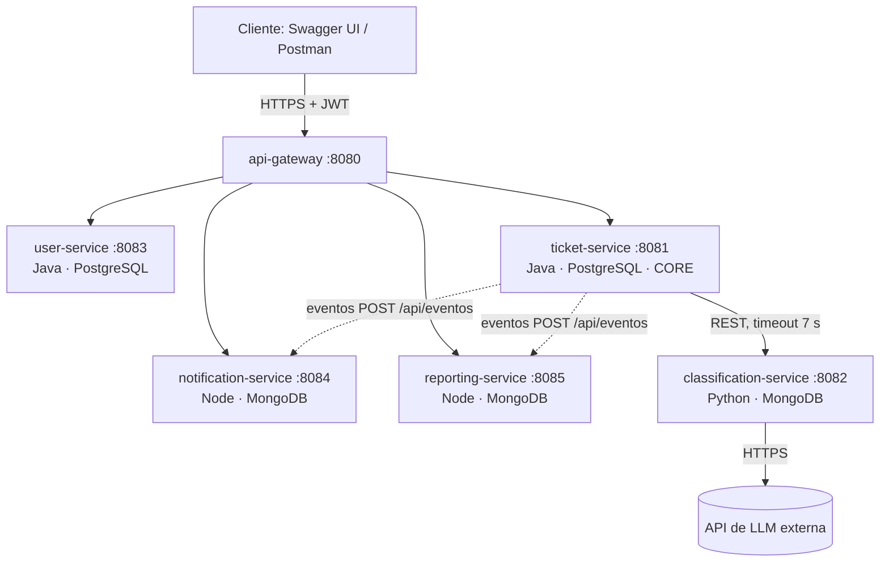
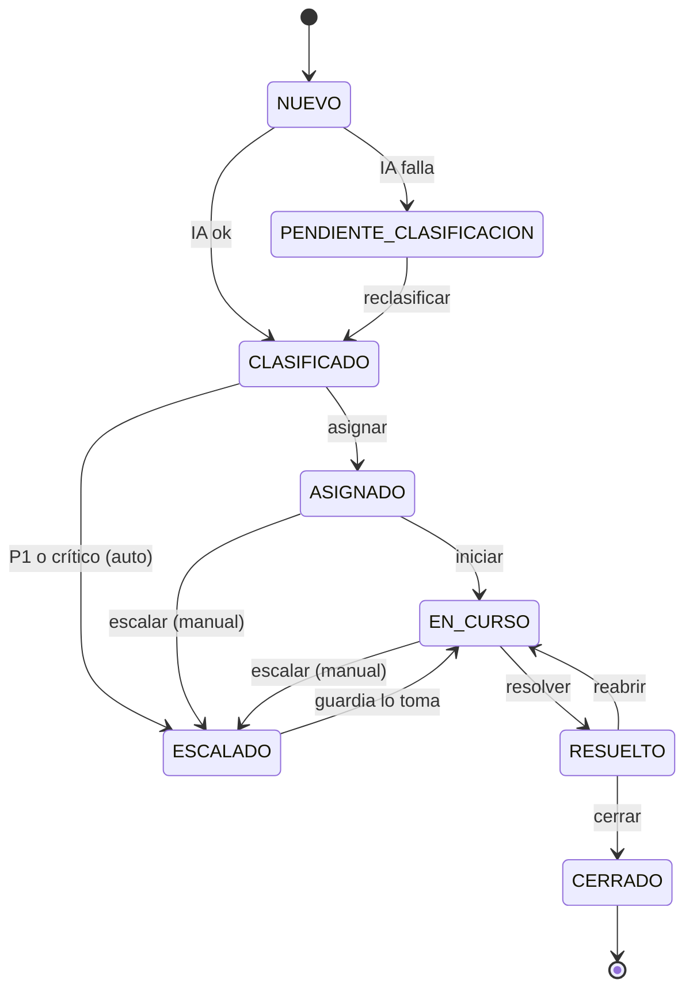
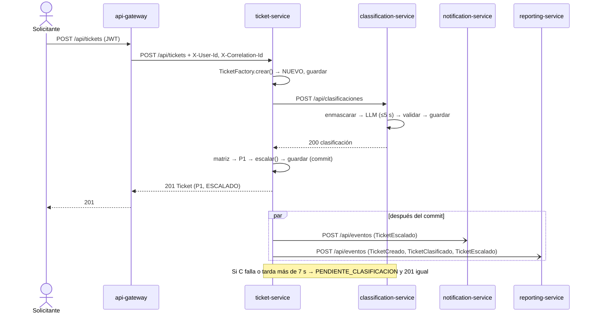

# CONTEXTO_PROYECTO.md — UrgentIA

> **Fuente única de verdad** del proyecto UrgentIA (TP de Desarrollo de Aplicaciones II, UADE).
> Todo el equipo (y sus asistentes de IA) trabaja a partir de este archivo.
> Versión: 1.2 · Fecha: 05/10/2026 · Alcance: Defensa 1 (con la parte 2 ya contemplada).

**Cambios de la versión 1.2**

- classification-service: la interfaz `LlmProvider` y la del repositorio pasan a `application/ports/` (un archivo por puerto), para que la capa de aplicación no dependa de infraestructura. Los adapters de LLM van uno por contrato de API (sección 4.1).
- Proveedores de LLM definidos: `mock`, `ollama` y `groq` (sección 12.1). Se suma la variable opcional `LLM_BASE_URL` (sección 14).
- `GET /api/clasificaciones`: `ticketId` pasa a ser un filtro opcional y la respuesta va paginada (sección 9.3).

**Cambios de la versión 1.1**

- El proyecto se llama **UrgentIA**. Cambian con el nombre: los paquetes Java (`com.urgentia.*`), la red de Compose (`urgentia-net`), los mails de los usuarios semilla (`@urgentia.local`) y el emisor del JWT (`urgentia-user-service`).
- Spring Boot queda fijado en la línea 3.5 (sección 3).
- Se actualizan a lo que ya está en el repo: estructura (sección 4), detalles del JWT y rutas públicas (sección 6), Compose y cómo correr (sección 14) y flujo de Git (sección 16).

---

## 0. Instrucciones para asistentes de IA (leer primero)

Si sos una IA ayudando a un integrante del equipo:

1. **Este archivo manda.** Si el código existente o el pedido del usuario contradicen algo de acá, avisale al usuario antes de seguir. No improvises contratos.
2. **No inventes ni renombres** endpoints, campos JSON, enums, nombres de eventos, puertos, variables de entorno ni nombres de bases. Usá exactamente los de este archivo.
3. **Trabajá solo dentro de la carpeta del servicio** del usuario, salvo que te pida explícitamente otra cosa. Nunca modifiques `contracts/` sin que el usuario lo pida.
4. **ticket-service:** el paquete `domain` es Java puro. Prohibido importar Spring, JPA, Jackson o cualquier framework ahí.
5. **Toda regla de negocio lleva test.** Generá tests junto con el código.
6. **Nombres:** conceptos del dominio en español sin tildes (`Ticket`, `Clasificacion`, `Prioridad`, `crearTicket`); sufijos técnicos en inglés (`Controller`, `Repository`, `Service`, `Dto`, `Mapper`).
7. **Nunca pongas secretos en el código** (API keys, contraseñas, `JWT_SECRET`). Siempre por variable de entorno.
8. **Mensajes de commit** en español con Conventional Commits: `feat(ticket): ...`, `fix(gateway): ...`, `test(ia): ...`, `docs: ...`.
9. Si falta información para implementar algo, **preguntá** en vez de suponer. Si algo no está definido acá, proponé una opción y marcala como pendiente de acordar.
10. **El proyecto se llama UrgentIA.** Si en tu contexto quedó otro nombre de una versión anterior de este archivo, no lo uses en paquetes, redes, mails ni textos.

---

## 1. Resumen del proyecto

**UrgentIA** es una mesa de ayuda donde el solicitante carga un ticket en texto libre. Un LLM analiza el texto y estima **categoría, urgencia, impacto y módulo afectado**. El dominio calcula la **prioridad (P1–P4)** con una matriz fija y, si el caso es crítico, **escala** el ticket y **notifica** a la guardia.

**Principio central:** la IA *sugiere*, el dominio *decide*. La IA nunca devuelve la prioridad.

**Demo de la Defensa 1:** crear desde Swagger un ticket con "Producción caída, todos los usuarios bloqueados en el login" → vuelve `P1`, estado `ESCALADO`, se registra una notificación a la guardia y aparece en el resumen de reportes.

---

## 2. Decisiones de arquitectura (ADR resumidos)

| # | Decisión | Motivo |
|---|---|---|
| ADR-01 | Microservicios desde la primera entrega, uno por bounded context | La consigna final pide SOA/microservicios; evita reescribir |
| ADR-02 | Base de datos propia por servicio (nunca se leen tablas ajenas) | Evitar el "monolito distribuido" |
| ADR-03 | Stack políglota: Java (gateway, tickets, usuarios), Python (IA), Node (notificaciones, reportes) | Python es el ecosistema de IA; demuestra independencia tecnológica. Máximo 3 lenguajes |
| ADR-04 | PostgreSQL para tickets y usuarios; MongoDB para clasificaciones, notificaciones y reportes | Relacional donde hay invariantes y transacciones; documentos donde la forma es flexible o es un read model |
| ADR-05 | API Gateway como única entrada; valida JWT | Seguridad y documentación centralizadas |
| ADR-06 | En la Defensa 1, clasificación por REST sincrónico con timeout y fallback | Simplicidad; en la parte 2 pasa a cola de mensajes |
| ADR-07 | Eventos de dominio con sobre estándar enviados por HTTP a suscriptores | En la parte 2 se cambia el transporte a RabbitMQ/Kafka sin cambiar el formato |
| ADR-08 | ticket-service con arquitectura hexagonal y DDD táctico; el resto con capas simples | El Core merece modelo rico; los subdominios de soporte no |
| ADR-09 | Contract-first: OpenAPI en `contracts/` antes del código | Permite trabajar en paralelo contra mocks |

> **Supuesto abierto:** el equipo maneja Java, Python y Node. Si alguien no maneja el lenguaje de su servicio, ese servicio pasa a Java (Spring Boot). Los contratos NO cambian.

---

## 3. Servicios

| Servicio | Puerto | Lenguaje / framework | Base de datos | Dueño | Responsabilidad |
|---|---|---|---|---|---|
| `api-gateway` | 8080 (único publicado) | Java 21, Spring Boot 3.5, Spring Cloud Gateway | — | P1 | Ruteo, validación JWT, autorización por rol, correlationId, Swagger agregado |
| `ticket-service` | 8081 | Java 21, Spring Boot 3.5, Spring Data JPA | PostgreSQL `tickets_db` | P2 | **Core Domain**: tickets, prioridad, SLA, estados, escalamiento, publica eventos |
| `classification-service` | 8082 | Python 3.12, FastAPI, Pydantic | MongoDB `classification_db` | P4 | Clasificación de texto con LLM (Model as a Service) |
| `user-service` | 8083 | Java 21, Spring Boot 3.5, Spring Security | PostgreSQL `users_db` | P3 | Usuarios, roles, login y emisión de JWT |
| `notification-service` | 8084 | Node 20, NestJS, TypeScript | MongoDB `notifications_db` | P5 | Consume eventos y registra/envía notificaciones (email simulado) |
| `reporting-service` | 8085 | Node 20, NestJS, TypeScript | MongoDB `reporting_db` | P6 | Lado de lectura (CQRS): proyecta eventos y expone reportes y SLA |

Infraestructura en Compose: `postgres` (postgres:16, puerto 5432) y `mongo` (mongo:7, puerto 27017).
Nombres DNS internos = nombre del servicio en Compose (ej.: `http://ticket-service:8081`).
En desarrollo, `postgres` y `mongo` publican su puerto solo en `127.0.0.1`, para poder usarlos desde el IDE.

**Versión de Spring Boot (servicios Java):** 3.5.16, con Spring Cloud 2025.0.3 donde haga falta. start.spring.io ya no ofrece Spring Boot 3: generar el proyecto ahí y reemplazar el bloque `<parent>` por el de `api-gateway/pom.xml`. No usar Spring Boot 4.

---

## 4. Estructura del repositorio

```
DA2UrgentIABackend/
├── README.md
├── CONTEXTO_PROYECTO.md          ← este archivo
├── docker-compose.yml
├── .env.example                  ← se copia a .env (el .env NO se commitea)
├── .github/workflows/ci.yml      ← CI: tests, imagen Docker y arranque del Compose
├── infra/
│   ├── postgres/init.sql         ← crea users_db, tickets_db y sus usuarios
│   └── mongo/init.js             ← crea usuarios de las 3 bases
├── contracts/
│   ├── ticket-service.yaml
│   ├── classification-service.yaml
│   ├── user-service.yaml
│   ├── notification-service.yaml
│   ├── reporting-service.yaml
│   └── events/ticket-events.schema.json
├── docs/
│   ├── diagrams/                 ← PlantUML/Mermaid de cada diagrama
│   └── adr/
├── api-gateway/                  (Maven)
├── ticket-service/               (Maven)
├── user-service/                 (Maven)
├── classification-service/       (pip)
├── notification-service/         (npm)
└── reporting-service/            (npm)
```

### 4.1 Estructura interna por servicio

**ticket-service (hexagonal)** — paquete base `com.urgentia.ticket`
```
domain/
  model/        Ticket, TicketId, Clasificacion, Sla, EstadoTicket, Prioridad,
                Categoria, Urgencia, Impacto, ModuloAfectado
  event/        DomainEvent, TicketCreado, TicketClasificado, TicketEscalado,
                TicketAsignado, TicketEstadoCambiado, TicketResuelto
  service/      PrioridadStrategy, MatrizItilStrategy
  factory/      TicketFactory
  exception/    TransicionInvalidaException, ReglaDeNegocioException
application/
  port/in/      CrearTicketUseCase, AsignarTicketUseCase, CambiarEstadoUseCase,
                ReclasificarTicketUseCase, ConsultarTicketsUseCase
  port/out/     TicketRepository, ClasificadorPort, EventPublisherPort
  service/      implementaciones de los casos de uso (orquestan, sin reglas)
infrastructure/
  rest/         TicketController, dto/, mapper/, GlobalExceptionHandler, HealthController
  persistence/  TicketJpaEntity, SpringDataTicketRepository, JpaTicketRepositoryAdapter
  client/       ClassificationHttpClient (ACL, implementa ClasificadorPort)
  messaging/    SpringEventPublisherAdapter, listeners que reenvían eventos por HTTP
  config/
```

**user-service (capas simples)** — `com.urgentia.user`: `controller/`, `service/`, `repository/`, `model/`, `dto/`, `security/` (JwtService, PasswordEncoder), `config/` (seed de datos).

**api-gateway** — `com.urgentia.gateway`: `filter/` (CorrelationIdFilter, JwtAuthFilter, RoleAuthorizationFilter), `config/` (rutas, Swagger agregado, formato de logs), `error/` (formato común de error), `health/` (HealthController).

**classification-service (Python)**
```
app/
  main.py, config.py (variables de entorno)
  domain/         enums.py, models.py (Clasificacion y sus invariantes)
  application/    ports/ (llm_provider.py, clasificacion_repository.py), clasificacion_facade.py, masking.py
  infrastructure/
    api/          routes.py, schemas.py (Pydantic de request/response), errors.py, health.py,
                  correlation.py, openapi.py
    llm/          mock_provider.py, openai_compatible_provider.py,
                  factory.py (LlmProviderFactory), response_parser.py (ACL)
    persistence/  clasificacion_repository.py (MongoDB)
    logs.py       logs JSON con correlationId
prompts/          clasificacion_v1.txt
scripts/          exportar_openapi.py (genera contracts/classification-service.yaml)
tests/            data/tickets_eval.json, test_*.py
```
Las dependencias apuntan hacia adentro (`infrastructure → application → domain`): `application/ports/` define las interfaces y los adapters de `infrastructure` las implementan. Los adapters de LLM van uno por contrato de API (sección 12.1).

**notification-service (NestJS)**
```
src/
  main.ts, app.module.ts
  eventos/          eventos.controller.ts (POST /api/eventos), eventos.service.ts, dto/
  notificaciones/   notificaciones.controller.ts, notificaciones.service.ts,
                    schemas/, reglas/, plantillas/,
                    canales/ (canal-notificacion.interface.ts, email-simulado.canal.ts, interna.canal.ts)
  common/           filtro de errores, middleware de correlationId
  health/
```

**reporting-service (NestJS)**
```
src/
  eventos/          eventos.controller.ts (POST /api/eventos), idempotencia
  proyecciones/     proyector.interface.ts, un proyector por tipo de evento
  reportes/         reportes.controller.ts, reportes.service.ts
  schemas/          ticket-view.schema.ts, evento-procesado.schema.ts
  common/, health/
```

---

## 5. Convenciones generales (aplican a TODOS los servicios)

| Tema | Regla |
|---|---|
| Formato | JSON, `Content-Type: application/json` |
| Nombres de campos | camelCase, en español sin tildes (`fechaCreacion`, `agenteAsignadoId`) |
| Enums | MAYÚSCULAS_CON_GUION_BAJO, valores exactos de la sección 7 |
| IDs | UUID v4 como string, salvo `id` de documentos Mongo (ObjectId como string) |
| Fechas | ISO-8601 en UTC con `Z`: `2026-10-05T14:03:11Z` |
| Paginación | query `page` (desde 0) y `size` (default 20, máx. 100). Respuesta: `{ "content": [...], "page": 0, "size": 20, "totalElements": 57, "totalPages": 3 }` |
| Health | `GET /health` → `200 { "status": "UP", "service": "ticket-service", "version": "0.1.0" }` |
| Documentación | OpenAPI en cada servicio (ver 5.2) |
| Logs | Una línea JSON por evento: `timestamp`, `level`, `service`, `correlationId`, `message` |
| Rutas | Plural y sin verbos: `/api/tickets`, `/api/usuarios`. La acción la da el método HTTP |

### 5.1 Headers

| Header | Quién lo pone | Uso |
|---|---|---|
| `Authorization: Bearer <jwt>` | Cliente → gateway | Solo lo valida el gateway |
| `X-Correlation-Id` | Gateway (lo genera si no viene) | Todo servicio lo loguea y lo reenvía en llamadas salientes y en eventos |
| `X-User-Id` | Gateway (claim `sub`) | Id del usuario autenticado |
| `X-User-Rol` | Gateway (claim `rol`) | Rol del usuario autenticado |

Los servicios internos **confían** en `X-User-Id` / `X-User-Rol` (red interna). Las llamadas entre servicios (ticket → classification, ticket → `/api/eventos`) no pasan por el gateway ni llevan JWT.

### 5.2 OpenAPI por servicio (para el Swagger agregado del gateway)

| Servicio | JSON de OpenAPI | UI propia |
|---|---|---|
| Java (springdoc) | `/v3/api-docs` | `/swagger-ui.html` |
| FastAPI | `/openapi.json` | `/docs` |
| NestJS | `/api-docs-json` | `/api-docs` |

El gateway expone el Swagger unificado en `http://localhost:8080/swagger-ui.html` con un selector por servicio.

### 5.3 Formato común de error

```json
{
  "codigo": "TRANSICION_INVALIDA",
  "mensaje": "No se puede pasar de CERRADO a EN_CURSO",
  "detalles": [ { "campo": "estado", "mensaje": "transición no permitida" } ],
  "timestamp": "2026-10-05T14:03:11Z",
  "path": "/api/tickets/7c9e6679-7425-40de-944b-e07fc1f90ae7/estado",
  "correlationId": "a8e1b2c3-..."
}
```
`detalles` es opcional (se usa en validación).

| HTTP | `codigo` | Cuándo |
|---|---|---|
| 400 | `VALIDACION` | Body o parámetros inválidos |
| 401 | `NO_AUTENTICADO` | Falta JWT o es inválido/expirado |
| 401 | `CREDENCIALES_INVALIDAS` | Login incorrecto |
| 403 | `SIN_PERMISO` | El rol no alcanza |
| 404 | `NO_ENCONTRADO` | El recurso no existe |
| 409 | `TRANSICION_INVALIDA` | Cambio de estado no permitido |
| 409 | `REGLA_DE_NEGOCIO` | Otra invariante violada (ej.: resolver sin agente) |
| 409 | `EMAIL_DUPLICADO` | Alta de usuario con email existente |
| 502 | `LLM_RESPUESTA_INVALIDA` | El LLM devolvió algo que no valida |
| 503 | `IA_NO_DISPONIBLE` | ticket-service no pudo clasificar en la reclasificación manual |
| 504 | `LLM_TIMEOUT` | El LLM no respondió en `LLM_TIMEOUT_MS` |
| 500 | `ERROR_INTERNO` | Cualquier otro error (sin stacktrace en la respuesta) |

---

## 6. Seguridad (JWT)

- Emite: `user-service`. Valida: `api-gateway`.
- Algoritmo **HS256** con `JWT_SECRET` (mínimo 32 caracteres), compartido por gateway y user-service.
- La clave son los bytes UTF-8 de `JWT_SECRET`, tal cual (sin decodificar Base64).
- Al firmar, indicar HS256 de forma explícita; no dejar que la librería elija el algoritmo según el largo de la clave.
- El gateway lee los claims `sub` (lo propaga como `X-User-Id`) y `rol` (como `X-User-Rol`). Un token sin alguno de los dos se rechaza con 401.
- Expiración: 60 minutos (`JWT_EXPIRATION_MINUTES`).
- Claims:

```json
{
  "sub": "b1c2d3e4-0000-4000-8000-000000000004",
  "email": "solicitante@urgentia.local",
  "nombre": "Sofía Solicitante",
  "rol": "SOLICITANTE",
  "iss": "urgentia-user-service",
  "iat": 1791300000,
  "exp": 1791303600
}
```

### 6.1 Rutas públicas y autorización (en el gateway)

| Ruta | Método | Roles |
|---|---|---|
| `/api/auth/login` | POST | Público |
| `/swagger-ui.html`, `/swagger-ui/**`, `/webjars/**`, `/v3/api-docs/**`, `/docs/**`, `/health` | GET | Público |
| `/api/usuarios` | POST | ADMIN |
| `/api/usuarios/**` | GET | AGENTE, ADMIN |
| `/api/tickets` | POST, GET | SOLICITANTE, AGENTE, ADMIN (un SOLICITANTE solo ve los suyos: lo filtra ticket-service con `X-User-Id`) |
| `/api/tickets/{id}` | GET | SOLICITANTE (solo propios), AGENTE, ADMIN |
| `/api/tickets/{id}/asignacion`, `/estado`, `/reclasificacion` | PATCH/POST | AGENTE, ADMIN |
| `/api/clasificaciones/**` | POST, GET | ADMIN (para pruebas; en el flujo normal la llama ticket-service por red interna) |
| `/api/notificaciones/**` | GET | AGENTE, ADMIN |
| `/api/reportes/**` | GET | AGENTE, ADMIN |
| `/api/eventos` | — | **No se rutea.** Solo red interna |

Lo que no figura en esta tabla se rechaza en el gateway: 401 sin token, 403 con token.

### 6.2 Usuarios semilla (user-service)

| Email | Contraseña | Rol | Nota |
|---|---|---|---|
| `admin@urgentia.local` | `Admin123!` | ADMIN | |
| `guardia@urgentia.local` | `Agente123!` | AGENTE | Equipo de guardia (recibe escalados) |
| `soporte@urgentia.local` | `Agente123!` | AGENTE | |
| `solicitante@urgentia.local` | `Usuario123!` | SOLICITANTE | Usado en la demo |
| `solicitante2@urgentia.local` | `Usuario123!` | SOLICITANTE | |

Contraseñas solo para desarrollo; se guardan con BCrypt.

---

## 7. Lenguaje ubicuo y enums (valores exactos)

| Enum | Valores |
|---|---|
| `Rol` | `SOLICITANTE`, `AGENTE`, `ADMIN` |
| `Categoria` | `INCIDENTE`, `SOLICITUD`, `CONSULTA`, `BUG` |
| `Urgencia` | `ALTA`, `MEDIA`, `BAJA` |
| `Impacto` | `ALTO`, `MEDIO`, `BAJO` |
| `Prioridad` | `P1`, `P2`, `P3`, `P4` |
| `EstadoTicket` | `NUEVO`, `PENDIENTE_CLASIFICACION`, `CLASIFICADO`, `ASIGNADO`, `EN_CURSO`, `ESCALADO`, `RESUELTO`, `CERRADO` |
| `ModuloAfectado` | `AUTENTICACION`, `FACTURACION`, `PAGOS`, `REPORTES`, `INFRAESTRUCTURA`, `BASE_DE_DATOS`, `INTEGRACIONES`, `OTRO` |
| `CanalNotificacion` | `EMAIL_SIMULADO`, `INTERNA` |
| `EstadoNotificacion` | `ENVIADA`, `FALLIDA` |
| `TipoEvento` | `TicketCreado`, `TicketClasificado`, `TicketEscalado`, `TicketAsignado`, `TicketEstadoCambiado`, `TicketResuelto` |

**Glosario**

| Término | Significado |
|---|---|
| Ticket | Pedido de ayuda o reporte de problema cargado por un Solicitante |
| Solicitante | Usuario que abre tickets |
| Agente | Usuario de soporte que resuelve tickets; la "guardia" es un agente que atiende escalados |
| Clasificación | Resultado de la IA: categoría, urgencia, impacto, módulo, confianza y justificación |
| Urgencia | Qué tan rápido hay que actuar |
| Impacto | A cuántos usuarios o procesos afecta (ALTO = muchos usuarios o producción) |
| Prioridad | Orden de atención P1–P4, calculado por el dominio a partir de urgencia × impacto |
| SLA | Tiempo máximo de resolución según la prioridad |
| Escalamiento | Derivación inmediata a la guardia de un ticket crítico |

---

## 8. Reglas de dominio (ticket-service)

### 8.1 Matriz de prioridad (`MatrizItilStrategy`, implementa `PrioridadStrategy`)

| Urgencia \ Impacto | ALTO | MEDIO | BAJO |
|---|---|---|---|
| **ALTA** | P1 | P2 | P3 |
| **MEDIA** | P2 | P3 | P4 |
| **BAJA** | P3 | P4 | P4 |

### 8.2 SLA

| Prioridad | Horas | `fechaLimiteSla` |
|---|---|---|
| P1 | 1 | fecha de clasificación + 1 h |
| P2 | 4 | + 4 h |
| P3 | 8 | + 8 h |
| P4 | 24 | + 24 h |

Horas corridas (no hábiles). Un ticket sin clasificar no tiene prioridad ni SLA (`null`).
**SLA vencido:** `fechaLimiteSla < ahora` y estado distinto de `RESUELTO` y `CERRADO`.

### 8.3 Escalamiento automático

Al aplicar una clasificación:
1. Se calcula la prioridad con la matriz.
2. Si `requiereEscalamiento == true` → la prioridad se fuerza a **P1**.
3. Si la prioridad final es **P1** → `escalar(motivo)` → estado `ESCALADO`, evento `TicketEscalado`.
   - `motivo`: `"Prioridad P1"` o `"Marcado como crítico por la IA"`.
4. Si `confianza < 0.6` → `requiereRevisionManual = true` (no cambia el estado).

### 8.4 Transiciones de estado permitidas

| Desde | Hacia | Cómo |
|---|---|---|
| `NUEVO` | `CLASIFICADO` | Clasificación exitosa al crear |
| `NUEVO` | `PENDIENTE_CLASIFICACION` | La IA falló o superó el timeout |
| `PENDIENTE_CLASIFICACION` | `CLASIFICADO` | `POST /reclasificacion` exitoso |
| `CLASIFICADO` | `ASIGNADO` | `PATCH /asignacion` |
| `CLASIFICADO` | `ESCALADO` | Automático (8.3) |
| `ASIGNADO` | `EN_CURSO` | `PATCH /estado` |
| `ASIGNADO` | `ESCALADO` | `PATCH /estado` con `motivo` (manual) |
| `EN_CURSO` | `RESUELTO` | `PATCH /estado` |
| `EN_CURSO` | `ESCALADO` | `PATCH /estado` con `motivo` (manual) |
| `ESCALADO` | `EN_CURSO` | `PATCH /estado` (la guardia lo toma; requiere agente asignado) |
| `RESUELTO` | `CERRADO` | `PATCH /estado` |
| `RESUELTO` | `EN_CURSO` | `PATCH /estado` (reabrir) |
| `CERRADO` | — | Estado final |

Cualquier otra → `TransicionInvalidaException` → HTTP 409 `TRANSICION_INVALIDA`.

**Reglas adicionales**
- `asignarA(agenteId)` solo en `CLASIFICADO` (pasa a `ASIGNADO`) o en `ESCALADO` (asigna sin cambiar el estado).
- Pasar a `EN_CURSO` o `RESUELTO` requiere `agenteAsignadoId != null` → si no, 409 `REGLA_DE_NEGOCIO`.
- `POST /reclasificacion` solo en `PENDIENTE_CLASIFICACION` o `CLASIFICADO`. En `CLASIFICADO` actualiza la clasificación, recalcula prioridad y SLA y puede escalar.
- `titulo`: 5 a 120 caracteres. `descripcion`: 10 a 2000 caracteres.
- La prioridad y el SLA **nunca** se setean a mano: solo por clasificación.

### 8.5 Eventos que emite el agregado

| Situación | Eventos (en orden) |
|---|---|
| Crear + clasificar OK, no crítico | `TicketCreado`, `TicketClasificado` |
| Crear + clasificar OK, crítico | `TicketCreado`, `TicketClasificado`, `TicketEscalado` |
| Crear con IA caída | `TicketCreado` |
| Reclasificar OK | `TicketClasificado` (+ `TicketEscalado` si corresponde) |
| Asignar | `TicketAsignado` (+ `TicketEstadoCambiado` si cambia el estado) |
| Cambio de estado | `TicketEstadoCambiado` (+ `TicketEscalado` si pasa a ESCALADO, + `TicketResuelto` si pasa a RESUELTO) |

---

## 9. Contratos por servicio

Todas las rutas de abajo son las **del servicio**; desde afuera se llaman igual a través del gateway (`http://localhost:8080/...`).

### 9.1 user-service (8083)

**`POST /api/auth/login`**
```json
// request
{ "email": "solicitante@urgentia.local", "password": "Usuario123!" }
// 200
{
  "accessToken": "eyJhbGciOiJIUzI1NiJ9...",
  "tokenType": "Bearer",
  "expiresIn": 3600,
  "usuario": { "id": "b1c2d3e4-...", "nombre": "Sofía Solicitante", "email": "solicitante@urgentia.local", "rol": "SOLICITANTE" }
}
// 401 CREDENCIALES_INVALIDAS
```

**`POST /api/usuarios`** (ADMIN)
```json
// request
{ "nombre": "Ana Agente", "email": "ana@urgentia.local", "password": "Segura123!", "rol": "AGENTE" }
// 201 → Usuario
// 409 EMAIL_DUPLICADO
```

**`GET /api/usuarios?rol=AGENTE&page=0&size=20`** → página de `Usuario`
**`GET /api/usuarios/{id}`** → `Usuario` | 404

`Usuario` (nunca incluye password ni hash):
```json
{ "id": "uuid", "nombre": "Ana Agente", "email": "ana@urgentia.local", "rol": "AGENTE", "activo": true, "fechaAlta": "2026-10-01T12:00:00Z" }
```

### 9.2 ticket-service (8081)

**`POST /api/tickets`** — `solicitanteId` sale de `X-User-Id`
```json
// request
{ "titulo": "No puede ingresar nadie", "descripcion": "Producción caída, todos los usuarios bloqueados en el login desde las 9" }
// 201 → Ticket (el flujo completo ocurre en esta llamada)
// 400 VALIDACION
```

**`GET /api/tickets?estado=&prioridad=&categoria=&page=0&size=20`** → página de `Ticket` (orden: prioridad asc, fechaCreacion desc)
**`GET /api/tickets/{id}`** → `Ticket` | 404

**`PATCH /api/tickets/{id}/asignacion`**
```json
{ "agenteId": "uuid-del-agente" }
// 200 → Ticket | 409 TRANSICION_INVALIDA
```

**`PATCH /api/tickets/{id}/estado`**
```json
{ "estado": "ESCALADO", "motivo": "El cliente reporta pérdida de datos" }
// motivo obligatorio solo para ESCALADO
// 200 → Ticket | 409 TRANSICION_INVALIDA | 409 REGLA_DE_NEGOCIO
```

**`POST /api/tickets/{id}/reclasificacion`** (sin body) → 200 `Ticket` | 409 | 503 `IA_NO_DISPONIBLE`

`Ticket`:
```json
{
  "id": "7c9e6679-7425-40de-944b-e07fc1f90ae7",
  "titulo": "No puede ingresar nadie",
  "descripcion": "Producción caída, todos los usuarios bloqueados en el login desde las 9",
  "solicitanteId": "b1c2d3e4-0000-4000-8000-000000000004",
  "agenteAsignadoId": null,
  "estado": "ESCALADO",
  "prioridad": "P1",
  "fechaLimiteSla": "2026-10-05T15:03:11Z",
  "requiereRevisionManual": false,
  "motivoEscalamiento": "Prioridad P1",
  "clasificacion": {
    "categoria": "INCIDENTE",
    "urgencia": "ALTA",
    "impacto": "ALTO",
    "moduloAfectado": "AUTENTICACION",
    "requiereEscalamiento": true,
    "confianza": 0.93,
    "justificacion": "Caída total del login en producción que afecta a todos los usuarios",
    "proveedor": "mock",
    "fecha": "2026-10-05T14:03:11Z"
  },
  "fechaCreacion": "2026-10-05T14:03:10Z",
  "fechaActualizacion": "2026-10-05T14:03:11Z"
}
```
Si está `PENDIENTE_CLASIFICACION`: `clasificacion`, `prioridad`, `fechaLimiteSla` y `motivoEscalamiento` van en `null`.

**Llamada saliente a classification-service:** `POST http://classification-service:8082/api/clasificaciones`, timeout **7 s** (`CLASSIFICATION_TIMEOUT_MS=7000`). Cualquier error, timeout o 5xx → el ticket queda en `PENDIENTE_CLASIFICACION` y la creación responde 201 igual.

### 9.3 classification-service (8082)

**`POST /api/clasificaciones`**
```json
// request
{ "ticketId": "7c9e6679-7425-40de-944b-e07fc1f90ae7", "titulo": "No puede ingresar nadie", "descripcion": "Producción caída, todos los usuarios bloqueados en el login desde las 9" }
// 200
{
  "id": "66f7c2a1e4b0a1b2c3d4e5f6",
  "ticketId": "7c9e6679-7425-40de-944b-e07fc1f90ae7",
  "categoria": "INCIDENTE",
  "urgencia": "ALTA",
  "impacto": "ALTO",
  "moduloAfectado": "AUTENTICACION",
  "requiereEscalamiento": true,
  "confianza": 0.93,
  "justificacion": "Caída total del login en producción que afecta a todos los usuarios",
  "proveedor": "mock",
  "modelo": "mock-v1",
  "versionPrompt": "v1",
  "latenciaMs": 812,
  "fecha": "2026-10-05T14:03:11Z"
}
// 400 VALIDACION | 502 LLM_RESPUESTA_INVALIDA | 504 LLM_TIMEOUT
```

**`GET /api/clasificaciones?ticketId=&page=0&size=20`** → página de clasificaciones (más reciente primero), con el formato de paginación de la sección 5. `ticketId` es un filtro opcional.

**Flujo interno (`ClasificacionFacade`)**
1. Validar request (Pydantic).
2. Enmascarar datos personales en título y descripción:
   - emails → `[EMAIL]`
   - teléfonos (secuencias de 8+ dígitos con espacios, guiones o `+`) → `[TELEFONO]`
   - DNI (7–8 dígitos, con o sin puntos) → `[DNI]`
3. Armar el prompt desde `prompts/clasificacion_v{PROMPT_VERSION}.txt`.
4. Llamar a `LlmProvider` (elegido por `LlmProviderFactory` según `LLM_PROVIDER`) con timeout `LLM_TIMEOUT_MS` (5000).
5. Parsear y validar (ACL, `response_parser.py`): JSON válido, enums dentro de las listas, `confianza` entre 0 y 1, `justificacion` ≤ 300 caracteres.
6. Si la validación falla y quedan ≥ 2 s del presupuesto total (6 s), reintentar una vez; si no, 502.
7. Guardar en Mongo (colección `clasificaciones`) con la respuesta cruda **ya enmascarada**, versión de prompt, modelo y latencia.
8. Responder.

**Documento Mongo `clasificaciones`:** los campos de la respuesta + `respuestaCruda` (string) + `textoEnmascarado` (string).

### 9.4 notification-service (8084)

**`POST /api/eventos`** (solo red interna) — body: sobre de evento (sección 10)
```json
// 202
{ "eventId": "3f1b2c4d-...", "resultado": "PROCESADO" }   // o "DUPLICADO" o "IGNORADO"
// 400 VALIDACION si el sobre no cumple el esquema
```

**Reglas**

| Evento | Destinatario | Canal | Asunto |
|---|---|---|---|
| `TicketEscalado` | `GRUPO:GUARDIA` | `EMAIL_SIMULADO` | `[P1] Ticket escalado: {titulo}` |
| `TicketAsignado` | `USUARIO:{agenteAsignadoId}` | `INTERNA` | `Se te asignó el ticket: {titulo}` |
| `TicketResuelto` | `USUARIO:{solicitanteId}` | `EMAIL_SIMULADO` | `Tu ticket fue resuelto: {titulo}` |
| Otros | — | — | Se responde `IGNORADO` |

`EMAIL_SIMULADO` = escribir una línea de log estructurado con destinatario, asunto y mensaje (no se envía mail real en la Defensa 1).

**`GET /api/notificaciones?ticketId=&destinatario=&page=0&size=20`** → página de `Notificacion`
**`GET /api/notificaciones/{id}`** → `Notificacion` | 404

`Notificacion`:
```json
{
  "id": "66f7c3b2e4b0a1b2c3d4e5f7",
  "eventId": "3f1b2c4d-...",
  "ticketId": "7c9e6679-...",
  "tipoEvento": "TicketEscalado",
  "destinatario": "GRUPO:GUARDIA",
  "canal": "EMAIL_SIMULADO",
  "asunto": "[P1] Ticket escalado: No puede ingresar nadie",
  "mensaje": "El ticket fue escalado. Motivo: Prioridad P1. SLA: 2026-10-05T15:03:11Z",
  "estado": "ENVIADA",
  "fecha": "2026-10-05T14:03:12Z"
}
```

### 9.5 reporting-service (8085)

**`POST /api/eventos`** (solo red interna) — igual que en notification-service (202 con `PROCESADO` / `DUPLICADO`).
Cada evento hace **upsert** del documento `ticket_view` usando el snapshot del payload. Si `occurredAt` es anterior al `ultimoEventoEn` guardado, no se pisa la vista (llegó tarde).

`ticket_view`:
```json
{
  "ticketId": "7c9e6679-...",
  "titulo": "No puede ingresar nadie",
  "estado": "ESCALADO",
  "prioridad": "P1",
  "categoria": "INCIDENTE",
  "moduloAfectado": "AUTENTICACION",
  "escalado": true,
  "solicitanteId": "uuid",
  "agenteAsignadoId": null,
  "fechaCreacion": "2026-10-05T14:03:10Z",
  "fechaLimiteSla": "2026-10-05T15:03:11Z",
  "fechaResolucion": null,
  "ultimoEventoEn": "2026-10-05T14:03:12Z"
}
```

**`GET /api/reportes/resumen`**
```json
{
  "total": 42,
  "abiertos": 30,
  "escalados": 3,
  "slaVencidos": 2,
  "porPrioridad": { "P1": 3, "P2": 5, "P3": 12, "P4": 20, "SIN_PRIORIDAD": 2 },
  "porCategoria": { "INCIDENTE": 18, "SOLICITUD": 10, "CONSULTA": 8, "BUG": 4, "SIN_CATEGORIA": 2 },
  "porEstado": { "NUEVO": 0, "PENDIENTE_CLASIFICACION": 2, "CLASIFICADO": 10, "ASIGNADO": 8, "EN_CURSO": 7, "ESCALADO": 3, "RESUELTO": 8, "CERRADO": 4 },
  "generadoEn": "2026-10-05T14:10:00Z"
}
```
"Abiertos" = todo estado distinto de `RESUELTO` y `CERRADO`.

**`GET /api/reportes/sla`**
```json
{
  "vencidos": [
    { "ticketId": "uuid", "titulo": "...", "prioridad": "P2", "estado": "EN_CURSO", "fechaLimiteSla": "2026-10-05T10:00:00Z", "horasVencido": 4.2 }
  ],
  "cumplimientoPorPrioridad": {
    "P1": { "resueltos": 4, "enTermino": 3, "porcentaje": 75.0 },
    "P2": { "resueltos": 0, "enTermino": 0, "porcentaje": null }
  },
  "generadoEn": "2026-10-05T14:10:00Z"
}
```
"En término" = `fechaResolucion <= fechaLimiteSla`.

**`GET /api/reportes/tickets?prioridad=&estado=&page=0&size=20`** → página de `ticket_view`.

---

## 10. Eventos de dominio

### 10.1 Sobre (igual para todos; en la parte 2 viaja igual por el broker)

```json
{
  "eventId": "3f1b2c4d-5e6f-4a7b-8c9d-0e1f2a3b4c5d",
  "eventType": "TicketEscalado",
  "version": 1,
  "occurredAt": "2026-10-05T14:03:12Z",
  "correlationId": "a8e1b2c3-...",
  "source": "ticket-service",
  "payload": {
    "ticket": {
      "ticketId": "7c9e6679-...",
      "titulo": "No puede ingresar nadie",
      "estado": "ESCALADO",
      "prioridad": "P1",
      "categoria": "INCIDENTE",
      "moduloAfectado": "AUTENTICACION",
      "solicitanteId": "uuid",
      "agenteAsignadoId": null,
      "fechaCreacion": "2026-10-05T14:03:10Z",
      "fechaLimiteSla": "2026-10-05T15:03:11Z"
    },
    "estadoAnterior": "CLASIFICADO",
    "motivo": "Prioridad P1"
  }
}
```

- `payload.ticket` (snapshot del ticket después del cambio) va **siempre**.
- `payload.estadoAnterior` va en `TicketEstadoCambiado`, `TicketEscalado` y `TicketResuelto`.
- `payload.motivo` va en `TicketEscalado`.
- No incluye `descripcion` (puede tener datos sensibles).
- El JSON Schema formal vive en `contracts/events/ticket-events.schema.json` (dueños: P5 con P2 y P6).

### 10.2 Suscriptores

| Evento | notification-service | reporting-service |
|---|---|---|
| `TicketCreado` | ignora | proyecta |
| `TicketClasificado` | ignora | proyecta |
| `TicketEscalado` | **notifica** | proyecta |
| `TicketAsignado` | **notifica** | proyecta |
| `TicketEstadoCambiado` | ignora | proyecta |
| `TicketResuelto` | **notifica** | proyecta (setea `fechaResolucion`) |

### 10.3 Entrega (Defensa 1)

- ticket-service publica **después del commit** (`@TransactionalEventListener(phase = AFTER_COMMIT)`) a cada URL de `EVENT_SUBSCRIBERS`, en paralelo y de forma asíncrona (`@Async`), sin bloquear la respuesta al cliente.
- Reintentos: 3 con espera 1 s, 2 s y 4 s. Si fallan todos, log `ERROR` con `eventId` (en la Defensa 1 se acepta la pérdida; en la parte 2 se resuelve con Transactional Outbox).
- **Consumidores idempotentes:** colección `eventos_procesados` con índice único en `eventId`; si ya existe, responder 202 `DUPLICADO` sin efectos.
- Entrega "al menos una vez": puede llegar repetido o desordenado.

---

## 11. Flujos principales (Mermaid para `docs/diagrams/`)

### 11.1 Arquitectura



### 11.2 Estados del ticket



### 11.3 Crear ticket crítico



---

## 12. Componente de IA

### 12.1 Proveedores

| `LLM_PROVIDER` | Adapter | URL base por defecto | API key | Descripción |
|---|---|---|---|---|
| `mock` | `MockLlmProvider` | — | No | **Default.** Reglas por palabras clave, sin internet. Lo usan todos para desarrollar, los tests, el CI y el plan B de la demo |
| `ollama` | `OpenAICompatibleProvider` | `http://host.docker.internal:11434/v1` | No | Modelo local con [Ollama](https://ollama.com) instalado en la máquina. No sale nada a internet |
| `groq` | `OpenAICompatibleProvider` | `https://api.groq.com/openai/v1` | Sí | API en internet con free tier. Cada integrante saca su key gratis en console.groq.com y la pone solo en su `.env` |

- Ollama y Groq hablan el contrato de la API de OpenAI (`/chat/completions`), así que comparten adapter (Strategy por contrato). Sumar otro proveedor compatible es solo configuración: `LLM_BASE_URL` y `LLM_MODEL`.
- `LLM_MODEL` elige el modelo de cada proveedor (por ejemplo, `qwen2.5:3b` en Ollama o `llama-3.3-70b-versatile` en Groq). `LLM_BASE_URL` pisa la URL por defecto.
- Privacidad: el texto se enmascara antes de salir del servicio (sección 9.3), sea cual sea el proveedor.

**Reglas del `MockLlmProvider`** (texto en minúsculas y sin tildes; se evalúan en orden):

| Si contiene… | categoria | urgencia | impacto | requiereEscalamiento |
|---|---|---|---|---|
| ("caida" o "no funciona" o "lento") y ("produccion" o "todos" o "nadie" o "toda la empresa") | INCIDENTE | ALTA | ALTO | true |
| "error" o "no puedo" o "falla" | INCIDENTE | MEDIA | BAJO (MEDIO si dice "companeros", "area" u "otros") | false |
| "bug" o "no hace nada" o "salio mal" o "incorrect" | BUG | MEDIA | BAJO | false |
| "necesito" o "solicito" o "alta de" o "dar de alta" | SOLICITUD | BAJA | BAJO | false |
| "como" o "consulta" o "?" | CONSULTA | BAJA | BAJO | false |
| (ninguna) | CONSULTA | BAJA | BAJO | false |

Módulo por palabra clave: "login", "contrasena", "ingresar", "usuario" → AUTENTICACION · "factura" → FACTURACION · "pago", "tarjeta" → PAGOS · "reporte", "excel", "pdf" → REPORTES · "servidor", "disco", "red" → INFRAESTRUCTURA · "base de datos", "consultas" → BASE_DE_DATOS · "banco", "sincronizacion", "integracion" → INTEGRACIONES · otro → OTRO.
`confianza` = 0.7, `proveedor` = `"mock"`, `modelo` = `"mock-v1"`. La justificación dice qué regla aplicó.

### 12.2 Prompt v1 (`prompts/clasificacion_v1.txt`)

```text
Sos un analista de mesa de ayuda de una empresa de software. Tu tarea es clasificar
tickets de soporte escritos en español por usuarios internos.

Respondé ÚNICAMENTE con un objeto JSON válido, sin texto adicional ni bloques de código,
con exactamente estas claves:
{
  "categoria": uno de ["INCIDENTE", "SOLICITUD", "CONSULTA", "BUG"],
  "urgencia": uno de ["ALTA", "MEDIA", "BAJA"],
  "impacto": uno de ["ALTO", "MEDIO", "BAJO"],
  "moduloAfectado": uno de ["AUTENTICACION", "FACTURACION", "PAGOS", "REPORTES",
                            "INFRAESTRUCTURA", "BASE_DE_DATOS", "INTEGRACIONES", "OTRO"],
  "requiereEscalamiento": true o false,
  "confianza": número entre 0 y 1,
  "justificacion": una oración de máximo 200 caracteres
}

Criterios:
- INCIDENTE: algo que funcionaba dejó de funcionar. BUG: comportamiento incorrecto puntual.
  SOLICITUD: pedido de algo nuevo (alta, permiso, cambio). CONSULTA: pregunta de uso.
- Urgencia ALTA: impide trabajar ahora. MEDIA: molesta pero hay alternativa. BAJA: puede esperar.
- Impacto ALTO: producción caída, toda la empresa o todos los usuarios. MEDIO: un área o varios
  usuarios. BAJO: un solo usuario.
- requiereEscalamiento = true SOLO si hay caída de producción, todos o muchos usuarios bloqueados,
  pérdida de datos o riesgo de seguridad.
- Los datos marcados como [EMAIL], [TELEFONO] o [DNI] fueron ocultados a propósito; ignoralos.

Ejemplos:
Ticket: "Producción caída" - "Nadie puede entrar al sistema desde las 9"
{"categoria":"INCIDENTE","urgencia":"ALTA","impacto":"ALTO","moduloAfectado":"AUTENTICACION","requiereEscalamiento":true,"confianza":0.95,"justificacion":"Caída total del acceso que afecta a todos los usuarios"}

Ticket: "Exportar a Excel" - "¿Cómo exporto el reporte mensual a Excel?"
{"categoria":"CONSULTA","urgencia":"BAJA","impacto":"BAJO","moduloAfectado":"REPORTES","requiereEscalamiento":false,"confianza":0.9,"justificacion":"Pregunta de uso sobre exportación de reportes"}

Ticket: "Factura mal" - "La factura del cliente salió con el IVA duplicado"
{"categoria":"BUG","urgencia":"MEDIA","impacto":"BAJO","moduloAfectado":"FACTURACION","requiereEscalamiento":false,"confianza":0.85,"justificacion":"Error de cálculo puntual en una factura"}

Ticket: "Alta de usuario" - "Necesito que den de alta a un empleado nuevo de ventas"
{"categoria":"SOLICITUD","urgencia":"BAJA","impacto":"BAJO","moduloAfectado":"AUTENTICACION","requiereEscalamiento":false,"confianza":0.9,"justificacion":"Pedido de alta de usuario sin urgencia"}

Ticket a clasificar:
Título: {titulo}
Descripción: {descripcion}
```

### 12.3 Set de evaluación base (`tests/data/tickets_eval.json`, completar hasta 20)

| # | Título | Descripción | categoria | urgencia | impacto | módulo | escalar | Prioridad esperada |
|---|---|---|---|---|---|---|---|---|
| 1 | Producción caída | Desde las 9 nadie puede ingresar al sistema, todos los usuarios quedan bloqueados en el login | INCIDENTE | ALTA | ALTO | AUTENTICACION | sí | P1 |
| 2 | No puedo pagar con tarjeta | Al confirmar el pago con mi tarjeta me da error 500; a otros compañeros del área también | INCIDENTE | ALTA | MEDIO | PAGOS | no | P2 |
| 3 | Factura con monto incorrecto | La factura de septiembre del cliente 4411 salió con IVA duplicado | BUG | MEDIA | BAJO | FACTURACION | no | P4 |
| 4 | Olvidé mi contraseña | No me llega el mail de recuperación de contraseña | INCIDENTE | MEDIA | BAJO | AUTENTICACION | no | P4 |
| 5 | Consulta sobre reportes | ¿Cómo exporto el reporte mensual de ventas a Excel? | CONSULTA | BAJA | BAJO | REPORTES | no | P4 |
| 6 | Alta de usuario nuevo | Necesito que den de alta a un empleado nuevo en el sistema con rol de ventas | SOLICITUD | BAJA | BAJO | AUTENTICACION | no | P4 |
| 7 | Sistema muy lento | Todas las consultas a la base de datos tardan más de 30 segundos desde esta mañana, afecta a toda la empresa | INCIDENTE | ALTA | ALTO | BASE_DE_DATOS | sí | P1 |
| 8 | Integración con el banco | La sincronización nocturna con el banco no corrió anoche; hoy hay que conciliar a mano | INCIDENTE | MEDIA | MEDIO | INTEGRACIONES | no | P3 |
| 9 | Botón de reporte no anda | El botón "Descargar PDF" del reporte de stock no hace nada en Firefox | BUG | BAJA | BAJO | REPORTES | no | P4 |
| 10 | Servidor sin espacio | El servidor de archivos está al 98% de disco y se va a llenar hoy | INCIDENTE | ALTA | MEDIO | INFRAESTRUCTURA | no | P2 |

**Criterio de aceptación (RIA01):** ≥ 80% de acierto en `categoria` y ≥ 90% en `requiereEscalamiento` sobre los 20 casos, con el proveedor real.
**Caso de privacidad (test de `masking.py`):** "Soy Juan, mi mail es juan.perez@empresa.com y mi celular 11-5555-1234, DNI 30.123.456" → no debe quedar ningún dato original en el texto enviado ni en Mongo.

---

## 13. Patrones de diseño por servicio

| Servicio | Patrones | Dónde |
|---|---|---|
| ticket-service | Factory, Repository, Strategy, Observer, Adapter/ACL, Aggregate, Value Object, Domain Event, Builder (tests) | `TicketFactory`, `TicketRepository`, `PrioridadStrategy`/`MatrizItilStrategy`, listeners de eventos, `ClassificationHttpClient` |
| classification-service | Facade, Strategy, Factory Method, Adapter/ACL, Repository | `ClasificacionFacade`, `LlmProvider`, `LlmProviderFactory`, `response_parser`, `clasificacion_repository` |
| user-service | Repository | `UsuarioRepository` |
| api-gateway | Chain of Responsibility, Proxy | Cadena de filtros, el gateway mismo |
| notification-service | Observer (consumidor), Strategy, Factory, Repository | Reglas por evento, `CanalNotificacion`, plantillas, repositorio Mongo |
| reporting-service | CQRS (lectura), Strategy, Repository | Proyectores por tipo de evento, `ticket_view` |

Cada README de servicio tiene una sección "Patrones aplicados" con clase/archivo y problema que resuelve.

---

## 14. Configuración y ejecución

### 14.1 `.env.example`

```dotenv
# Seguridad
JWT_SECRET=cambiar-por-un-secreto-de-al-menos-32-caracteres
JWT_EXPIRATION_MINUTES=60

# PostgreSQL
POSTGRES_PASSWORD=postgres
USERS_DB_PASSWORD=users_pass
TICKETS_DB_PASSWORD=tickets_pass

# MongoDB
MONGO_ROOT_PASSWORD=mongo
CLASSIFICATION_DB_PASSWORD=classification_pass
NOTIFICATIONS_DB_PASSWORD=notifications_pass
REPORTING_DB_PASSWORD=reporting_pass

# IA
LLM_PROVIDER=mock
LLM_API_KEY=
LLM_MODEL=
LLM_BASE_URL=
LLM_TIMEOUT_MS=5000
PROMPT_VERSION=v1

# Integración
CLASSIFICATION_TIMEOUT_MS=7000
LOG_LEVEL=INFO
```

### 14.2 Variables por servicio

| Servicio | Variables |
|---|---|
| api-gateway | `JWT_SECRET`, `USER_SERVICE_URL=http://user-service:8083`, `TICKET_SERVICE_URL=http://ticket-service:8081`, `CLASSIFICATION_SERVICE_URL=http://classification-service:8082`, `NOTIFICATION_SERVICE_URL=http://notification-service:8084`, `REPORTING_SERVICE_URL=http://reporting-service:8085` |
| user-service | `DB_URL=jdbc:postgresql://postgres:5432/users_db`, `DB_USER=users_user`, `DB_PASSWORD`, `JWT_SECRET`, `JWT_EXPIRATION_MINUTES` |
| ticket-service | `DB_URL=jdbc:postgresql://postgres:5432/tickets_db`, `DB_USER=tickets_user`, `DB_PASSWORD`, `CLASSIFICATION_URL=http://classification-service:8082`, `CLASSIFICATION_TIMEOUT_MS`, `EVENT_SUBSCRIBERS=http://notification-service:8084/api/eventos,http://reporting-service:8085/api/eventos` |
| classification-service | `MONGO_URI=mongodb://classification_user:<pass>@mongo:27017/classification_db`, `LLM_PROVIDER`, `LLM_API_KEY`, `LLM_MODEL`, `LLM_BASE_URL`, `LLM_TIMEOUT_MS`, `PROMPT_VERSION` |
| notification-service | `MONGO_URI=mongodb://notifications_user:<pass>@mongo:27017/notifications_db` |
| reporting-service | `MONGO_URI=mongodb://reporting_user:<pass>@mongo:27017/reporting_db` |

### 14.3 `docker-compose.yml`

`postgres`, `mongo` y `api-gateway` ya están en el archivo del repo, que es el que vale. Cada dueño suma la entrada de su servicio siguiendo el ejemplo de `ticket-service`.

```yaml
services:
  postgres:
    image: postgres:16
    environment:
      POSTGRES_PASSWORD: ${POSTGRES_PASSWORD}
      USERS_DB_PASSWORD: ${USERS_DB_PASSWORD}
      TICKETS_DB_PASSWORD: ${TICKETS_DB_PASSWORD}
    ports:
      - "127.0.0.1:5432:5432"
    volumes:
      - pgdata:/var/lib/postgresql/data
      - ./infra/postgres/init.sql:/docker-entrypoint-initdb.d/init.sql:ro
    healthcheck:
      test: ["CMD-SHELL", "pg_isready -U postgres -h 127.0.0.1"]
      interval: 5s
      retries: 10
    networks: [urgentia-net]

  mongo:
    image: mongo:7
    environment:
      MONGO_INITDB_ROOT_USERNAME: root
      MONGO_INITDB_ROOT_PASSWORD: ${MONGO_ROOT_PASSWORD}
      CLASSIFICATION_DB_PASSWORD: ${CLASSIFICATION_DB_PASSWORD}
      NOTIFICATIONS_DB_PASSWORD: ${NOTIFICATIONS_DB_PASSWORD}
      REPORTING_DB_PASSWORD: ${REPORTING_DB_PASSWORD}
    ports:
      - "127.0.0.1:27017:27017"
    volumes:
      - mongodata:/data/db
      - ./infra/mongo/init.js:/docker-entrypoint-initdb.d/init.js:ro
    healthcheck:
      test: ["CMD-SHELL", "mongosh --quiet --host $$(hostname) --eval \"db.adminCommand('ping')\""]
      interval: 5s
      retries: 10
    networks: [urgentia-net]

  api-gateway:
    build: ./api-gateway
    ports:
      - "8080:8080"
    environment:
      JWT_SECRET: ${JWT_SECRET}
      USER_SERVICE_URL: http://user-service:8083
      TICKET_SERVICE_URL: http://ticket-service:8081
      CLASSIFICATION_SERVICE_URL: http://classification-service:8082
      NOTIFICATION_SERVICE_URL: http://notification-service:8084
      REPORTING_SERVICE_URL: http://reporting-service:8085
    healthcheck:
      test: ["CMD", "curl", "-fsS", "http://localhost:8080/health"]
      interval: 5s
      retries: 20
    networks: [urgentia-net]

  # Ejemplo para sumar un servicio (todavía no está en el archivo del repo):
  ticket-service:
    build: ./ticket-service
    env_file: .env
    environment:
      DB_URL: jdbc:postgresql://postgres:5432/tickets_db
      DB_USER: tickets_user
      DB_PASSWORD: ${TICKETS_DB_PASSWORD}
      CLASSIFICATION_URL: http://classification-service:8082
      EVENT_SUBSCRIBERS: http://notification-service:8084/api/eventos,http://reporting-service:8085/api/eventos
    depends_on:
      postgres: { condition: service_healthy }
    networks: [urgentia-net]

  # user-service, classification-service, notification-service y reporting-service: mismo patrón

volumes:
  pgdata:
  mongodata:

networks:
  urgentia-net:
```

Cada servicio suma también su `healthcheck` contra `GET /health`: el CI levanta todo el Compose y espera a que esté sano.

Imágenes base sugeridas: `eclipse-temurin:21-jre` (Java, build multi-stage con `maven:3.9-eclipse-temurin-21`), `python:3.12-slim`, `node:20-alpine`.

### 14.4 Cómo correr

```bash
cp .env.example .env
docker compose up -d --build --wait
# Swagger unificado: http://localhost:8080/swagger-ui.html
# Estado del gateway:  http://localhost:8080/health
```

---

## 15. Testing y Definition of Done

**Tests mínimos por servicio**

| Servicio | Qué se testea | Herramienta |
|---|---|---|
| ticket-service | Dominio (transiciones, matriz 9 casos, escalamiento, invariantes) sin Spring; integración de repositorio y del caso "IA caída" | JUnit 5, AssertJ, Testcontainers/H2, WireMock |
| user-service | Login OK/incorrecto, JWT generado, email duplicado | JUnit 5, Spring Boot Test |
| classification-service | Enmascarado, parser/validación, mock provider, set de evaluación | pytest |
| notification-service | Reglas por evento, plantillas, idempotencia | Jest |
| reporting-service | Proyectores, cálculo de SLA vencido y cumplimiento | Jest |
| api-gateway | Rutas públicas, JWT inválido → 401, rol insuficiente → 403 | Spring Boot Test |

**Definition of Done de una tarea**
- [ ] Compila y los tests pasan (CI en verde)
- [ ] Respeta contratos, enums y formato de error de este archivo
- [ ] Swagger/OpenAPI actualizado con ejemplos
- [ ] `GET /health` responde
- [ ] Logs con `correlationId`
- [ ] Sin secretos en el código
- [ ] README del servicio actualizado (cómo correrlo y patrones aplicados)
- [ ] PR aprobado por el revisor asignado

---

## 16. Flujo de trabajo con Git

- `main` está protegida. El trabajo de la entrega 1 se integra en `dev/entrega-1`: no se puede pushear directo, todo entra por Pull Request.
- Ramas de tarea: `feat/<servicio>-<tema>`, `fix/...`, `chore/...`, `docs/...`, `test/...`. Salen de `dev/entrega-1` (o de la rama propia del servicio) y vuelven por PR.
- Mergear con "Create a merge commit", sin squash: así se conservan los commits de cada integrante.
- Cada PR y cada push a `main` o a ramas `dev/**` corre el CI (`.github/workflows/ci.yml`): tests de cada servicio, construcción de su imagen Docker y arranque del Compose completo.
- Para la defensa, `dev/entrega-1` se lleva a `main` con merge commit.
- Commits: Conventional Commits en español (`feat(ticket): agrega matriz de prioridad`).
- Commits chicos y frecuentes: el docente revisa quién hizo qué.
- Nunca commitear `.env`, API keys ni carpetas `target/`, `node_modules/`, `__pycache__/`.
- Cambiar un contrato: PR que toque `contracts/` + aviso en el grupo + aprobación del consumidor afectado.

---

## 17. Roadmap parte 2 (no implementar ahora, pero no bloquearlo)

- Transporte de eventos: HTTP → **RabbitMQ o Kafka** (mismo sobre, mismos nombres). ticket-service con **Transactional Outbox**.
- Clasificación **asincrónica**: `TicketCreado` → cola → classification-service como worker → `TicketClasificado`.
- **Servicio SOAP** (WSDL) de consulta de estado de tickets.
- **API externa real** (por ejemplo, envío real de emails o mensajería para notificaciones).
- Pruebas de integración de punta a punta, carga básica y manual de despliegue.

**Para no bloquearlo:** no acoplar la lógica de eventos al transporte HTTP (usar `EventPublisherPort`); mantener los consumidores idempotentes; no usar `descripcion` en los eventos.

---

## 18. Decisiones pendientes

| Tema | Estado | Responsable |
|---|---|---|
| Proveedor de LLM real y quién aporta la API key | Resuelto (v1.2): `ollama` local y `groq`; cada uno usa su propia key de Groq (sección 12.1) | P4 |
| Fecha exacta de la Defensa 1 | Estimada 12/10 | Todos |
| Confirmar lenguajes por integrante (Java/Python/Node) | Pendiente | Todos, 29/9 |
| Nombres de integrantes por rol P1–P6 | Pendiente | Todos |
| Swagger unificado: que cada servicio declare el esquema de seguridad `bearer` en su OpenAPI (para el botón Authorize) y que los Java usen `server.forward-headers-strategy=framework` (para que "Try it out" pase por el gateway) | A verificar con el primer servicio detrás del gateway | P1 con P2 y P3 |
