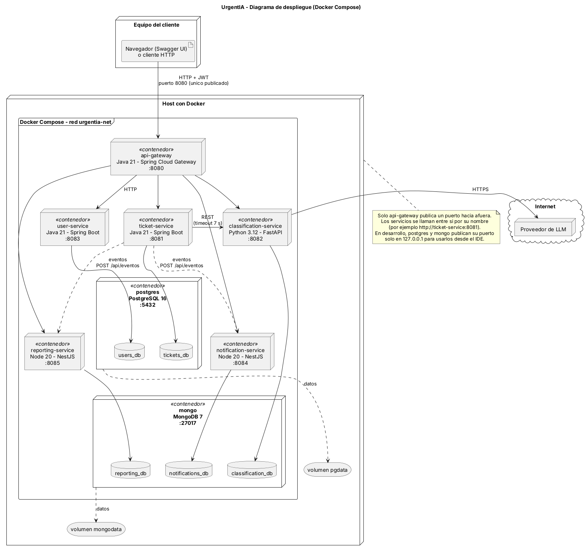

# DA2UrgentIABackend

Backend de **UrgentIA**, una mesa de ayuda que prioriza sola. El solicitante carga un ticket
en texto libre; un modelo de lenguaje estima categoría, urgencia, impacto y módulo afectado;
el dominio calcula la prioridad (P1 a P4) con una matriz fija y, si el caso es crítico,
escala el ticket y avisa a la guardia.

La IA sugiere y el dominio decide: la IA nunca devuelve la prioridad.

Trabajo práctico de Desarrollo de Aplicaciones II (UADE).

## Arquitectura

Seis servicios, cada uno con su propia base de datos, detrás de un gateway que es la única
entrada desde afuera.

| Servicio | Puerto | Tecnología | Base de datos | Qué hace |
|---|---|---|---|---|
| `api-gateway` | 8080 | Java 21, Spring Cloud Gateway | — | Entrada única: valida el token, controla el rol y rutea |
| `ticket-service` | 8081 | Java 21, Spring Boot | PostgreSQL | Tickets, prioridad, SLA, estados y escalamiento |
| `classification-service` | 8082 | Python 3.12, FastAPI | MongoDB | Clasifica el texto del ticket con un LLM |
| `user-service` | 8083 | Java 21, Spring Boot | PostgreSQL | Usuarios, roles y login |
| `notification-service` | 8084 | Python 3.12, FastAPI | MongoDB | Notifica a partir de los eventos del ticket |
| `reporting-service` | 8085 | Node 20, NestJS | MongoDB | Reportes y cumplimiento de SLA |



El detalle completo (contratos, enums, reglas de negocio, eventos) está en
[`CONTEXTO_PROYECTO.md`](CONTEXTO_PROYECTO.md), que es la fuente de verdad técnica.

## Cómo ejecutar

Hace falta Docker Desktop y Git. No hace falta instalar Java, Python ni Node.

```bash
git clone https://github.com/AVFare/DA2UrgentIABackend.git
cd DA2UrgentIABackend
cp .env.example .env
docker compose up -d --build --wait
```

El último comando construye las imágenes, levanta todo y espera a que cada contenedor esté
sano. La primera vez tarda varios minutos.

El Compose incluye los seis servicios y las dos bases de datos. Las consultas de reportes
se acceden por el gateway con un JWT de AGENTE o ADMIN; los eventos de P6 quedan en la red interna.

| Para | Abrir o correr |
|---|---|
| Usar la API desde el navegador | http://localhost:8080/swagger-ui.html |
| Ver que el gateway responde | http://localhost:8080/health |
| Ver el estado de los contenedores | `docker compose ps` |
| Ver los logs de un servicio | `docker compose logs api-gateway` |
| Frenar todo | `docker compose down` |
| Frenar y borrar los datos | `docker compose down -v` |

Los valores de `.env.example` sirven para desarrollo. El archivo `.env` no se sube al
repositorio.

## Estructura del repositorio

```
├── api-gateway/              Java (Maven)
├── ticket-service/           Java (Maven)
├── user-service/             Java (Maven)
├── classification-service/   Python (pip)
├── notification-service/     Python (pip)
├── reporting-service/        Node (npm)
├── contracts/                OpenAPI de cada servicio y esquema de los eventos
├── docs/                     Diagramas y decisiones de arquitectura
├── infra/                    Scripts de inicio de PostgreSQL y MongoDB
├── docker-compose.yml
├── .env.example
└── CONTEXTO_PROYECTO.md
```

Cada servicio tiene su propio README con cómo correrlo, sus tests y los patrones de diseño
que aplica.

## 🌿 Convención de ramas

Para mantener organizado el repositorio, las ramas deberán nombrarse utilizando la siguiente convención:

```text
tipo/descripcion-corta
```

Se utilizarán los siguientes prefijos:

* `feat/` → Desarrollo de una nueva funcionalidad.
* `fix/` → Corrección de errores.
* `refactor/` → Modificación o reorganización de código sin agregar una nueva funcionalidad.
* `chore/` → Configuraciones, mantenimiento o cambios que no afectan la lógica de la aplicación.
* `docs/` → Cambios relacionados con documentación.

### Ejemplos

```text
feat/ticket-matriz-prioridad
feat/gateway-rutas
feat/user-login
feat/notification-canales
fix/gateway-jwt
refactor/ticket-casos-de-uso
docs/update-readme
chore/project-setup
```

La rama `main` contendrá la versión estable del proyecto. El desarrollo de nuevas funcionalidades se realizará en ramas independientes y, una vez finalizadas, se integrarán a `dev/entrega-1` mediante Pull Request. Al cierre de la entrega, `dev/entrega-1` pasa a `main`.

## Integración continua

Cada Pull Request y cada push a `main` o a ramas `dev/**` corre el pipeline de
`.github/workflows/ci.yml`: los tests de cada servicio, la construcción de su imagen Docker
y el arranque completo con Docker Compose. Un servicio que todavía no tiene proyecto se
saltea.