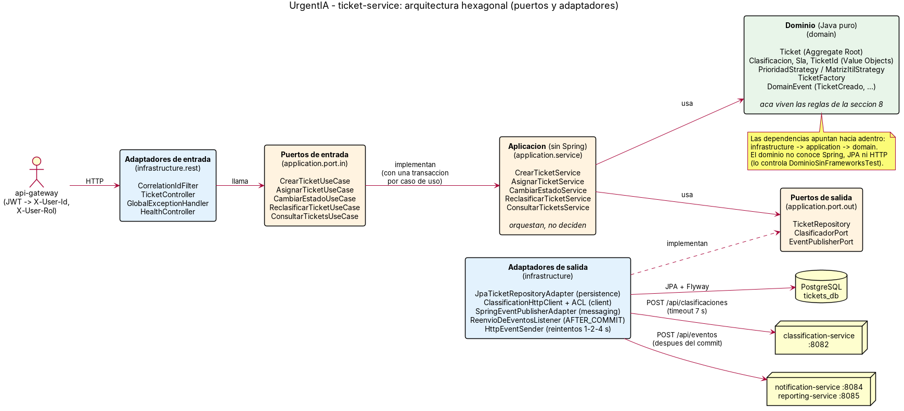

# ticket-service

**Core Domain** de UrgentIA. Recibe los tickets, le pide a la IA que los clasifique y, con
eso, el dominio calcula la prioridad (P1 a P4), el SLA y decide si hay que escalar. También
maneja la asignación y los cambios de estado, y publica los eventos que consumen
notification-service y reporting-service.

> La IA **sugiere** (categoría, urgencia, impacto, módulo) y el dominio **decide** (prioridad,
> SLA, escalamiento). La IA nunca devuelve la prioridad.

- **Stack:** Java 21, Spring Boot 3.5, Spring Data JPA, Flyway, Maven.
- **Puerto:** 8081 (no se publica: se entra por el gateway en 8080).
- **Base de datos:** PostgreSQL `tickets_db` (usuario `tickets_user`).
- **Dueño:** P2 · revisa PRs: P3.

## Cómo correrlo

### Con Docker Compose (lo normal)

Desde la raíz del repositorio:

```
cp .env.example .env
docker compose up -d --build --wait
```

Levanta PostgreSQL, el gateway y ticket-service. Si classification-service todavía no está
en el Compose, los tickets se crean igual y quedan `PENDIENTE_CLASIFICACION` (es el
comportamiento esperado cuando la IA no responde).

### Desde el IDE

1. Levantar solo la base: `docker compose up -d postgres`.
2. Abrir `ticket-service/pom.xml` como proyecto Maven, con JDK 21.
3. En la configuración de ejecución de `TicketServiceApplication`, agregar la variable de
   entorno `DB_PASSWORD=tickets_pass` (la de `.env.example`). Sin ella no arranca, a propósito.
4. Ejecutar `TicketServiceApplication`. Flyway crea la tabla `tickets` la primera vez.

### Tests

```
cd ticket-service
mvn verify
```

Corre todos los tests (no hace falta Docker: usan H2 en memoria y servidores HTTP de mentira
para la IA y los suscriptores) y exige **80 % de cobertura de líneas en el paquete `domain`**
con JaCoCo. El reporte queda en `target/site/jacoco/index.html`.

| Qué se prueba | Dónde |
|---|---|
| Matriz de prioridad (las 9 combinaciones), SLA, escalamiento, confianza baja | `domain/...` |
| Tabla de transiciones completa (los 64 pares desde/hacia) y reglas de agente y motivo | `TicketTransicionesTest` |
| Que `domain` y `application` no importen Spring, JPA ni Jackson | `DominioSinFrameworksTest` |
| Casos de uso con dobles de los puertos (sin Spring) | `CasosDeUsoTest` |
| API completa: alta, demo P1, IA caída / lenta / respuesta inválida, reclasificación, estados, errores, listado, permisos del solicitante | `TicketApiTest` |
| Eventos: orden, sobre de la sección 10.1 y validación contra `contracts/events/ticket-events.schema.json` | `EventosDeTicketTest` |
| Reintentos 1-2-4 s, sin reintento ante 4xx, un suscriptor caído no frena al otro | `HttpEventSenderTest` |
| Lo que publica springdoc coincide con `contracts/ticket-service.yaml` | `ContratoOpenApiTest` |
| Persistencia y control de concurrencia optimista | `JpaTicketRepositoryAdapterTest` |

### Comprobar que anda

| URL | Qué muestra |
|---|---|
| `http://localhost:8080/swagger-ui.html` → `ticket-service` | Swagger, a través del gateway (con el botón Authorize) |
| `GET /health` | `{"status":"UP","service":"ticket-service","version":"0.1.0"}` |

Llamado directo al servicio (sin gateway, solo desarrollo): hay que mandar los headers que
normalmente pone el gateway.

```
curl -X POST http://localhost:8081/api/tickets \
  -H "Content-Type: application/json" \
  -H "X-User-Id: b1c2d3e4-0000-4000-8000-000000000004" \
  -H "X-User-Rol: SOLICITANTE" \
  -d '{"titulo":"No puede ingresar nadie","descripcion":"Producción caída, todos los usuarios bloqueados en el login desde las 9"}'
```

## Configuración

Todo por variables de entorno; no hay secretos en el código.

| Variable | Obligatoria | Valor por defecto | Uso |
|---|---|---|---|
| `DB_PASSWORD` | Sí | — | Contraseña de `tickets_user` |
| `DB_URL` | No | `jdbc:postgresql://localhost:5432/tickets_db` | Base de datos |
| `DB_USER` | No | `tickets_user` | Usuario de la base |
| `CLASSIFICATION_URL` | No | `http://localhost:8082` | Dónde está classification-service |
| `CLASSIFICATION_TIMEOUT_MS` | No | `7000` | Timeout de la llamada a la IA |
| `EVENT_SUBSCRIBERS` | No | (vacío) | URLs de `POST /api/eventos`, separadas por coma |
| `LOG_LEVEL` | No | `INFO` | Nivel de log |

## API

Contrato completo: [`contracts/ticket-service.yaml`](../contracts/ticket-service.yaml).

| Método y ruta | Qué hace | Errores |
|---|---|---|
| `POST /api/tickets` | Crea, clasifica, calcula prioridad y SLA, y escala si corresponde | 400 |
| `GET /api/tickets?estado=&prioridad=&categoria=&page=&size=` | Lista (P1 primero; sin prioridad al final). Un SOLICITANTE ve solo los suyos | 400 |
| `GET /api/tickets/{id}` | Detalle. Un SOLICITANTE solo los suyos | 400, 404 |
| `PATCH /api/tickets/{id}/asignacion` | Asigna un agente | 400, 404, 409 |
| `PATCH /api/tickets/{id}/estado` | Cambia el estado (motivo obligatorio para ESCALADO) | 400, 404, 409 |
| `POST /api/tickets/{id}/reclasificacion` | Vuelve a pedir la clasificación | 404, 409, 503 |

Todos los errores salen con el formato común de la sección 5.3 (`codigo`, `mensaje`,
`detalles`, `timestamp`, `path`, `correlationId`).

## Cómo está armado (arquitectura hexagonal)



```
com.urgentia.ticket
├── domain/            Java puro: reglas de negocio (sección 8)
│   ├── model/         Ticket, TicketId, Clasificacion, Sla y los enums
│   ├── event/         DomainEvent y los 6 eventos
│   ├── service/       PrioridadStrategy, MatrizItilStrategy
│   ├── factory/       TicketFactory
│   └── exception/     TransicionInvalidaException, ReglaDeNegocioException
├── application/       Casos de uso: orquestan, no deciden (tampoco usan Spring)
│   ├── port/in/       CrearTicketUseCase, AsignarTicketUseCase, CambiarEstadoUseCase,
│   │                  ReclasificarTicketUseCase, ConsultarTicketsUseCase
│   ├── port/out/      TicketRepository, ClasificadorPort, EventPublisherPort
│   └── service/       Una implementación por caso de uso
└── infrastructure/    Adaptadores (Spring)
    ├── rest/          TicketController, DTOs, GlobalExceptionHandler, CorrelationIdFilter, HealthController
    ├── persistence/   TicketJpaEntity, JpaTicketRepositoryAdapter (+ migraciones Flyway)
    ├── client/        ClassificationHttpClient + ClasificacionTraductor (ACL)
    ├── messaging/     SpringEventPublisherAdapter, ReenvioDeEventosListener, HttpEventSender
    └── config/        TicketServiceConfig, CasosDeUsoTransaccionales, OpenApiConfig, logs JSON
```

Las dependencias apuntan siempre hacia adentro: `infrastructure` → `application` → `domain`.
`DominioSinFrameworksTest` hace fallar el build si alguien importa Spring, JPA o Jackson en
`domain` o en `application`.

Diagramas: [clases](../docs/diagrams/clases-ticket.png) ·
[estados](../docs/diagrams/estados-ticket.png) · [capas](../docs/diagrams/capas-ticket-service.png).

### Qué pasa al crear un ticket

1. `TicketController` valida el body y toma el solicitante de `X-User-Id`.
2. `CasosDeUsoTransaccionales` abre una transacción y llama a `CrearTicketService`.
3. `TicketFactory` crea el `Ticket` en `NUEVO` (registra `TicketCreado`).
4. `ClassificationHttpClient` llama a la IA (timeout 7 s). Si falla, el ticket pasa a
   `PENDIENTE_CLASIFICACION` y se sigue igual: el alta nunca falla por la IA.
5. `Ticket.aplicarClasificacion()` calcula la prioridad con `MatrizItilStrategy`; si la IA lo
   marcó crítico la fuerza a P1; calcula el SLA; si queda P1, escala (`TicketClasificado`,
   `TicketEscalado`).
6. Se guarda y se publican los eventos. **Recién cuando la transacción confirma**
   (`@TransactionalEventListener(AFTER_COMMIT)`), se encolan para enviarlos por HTTP.
7. Se responde `201` sin esperar a que lleguen los eventos.

### Detalles de diseño que conviene saber

- **Una transacción por caso de uso, puesta por la infraestructura** (`CasosDeUsoTransaccionales`,
  patrón Decorator). Así `application` no depende de Spring.
- **No se ocupa una conexión mientras se espera a la IA:** Hikari con `auto-commit: false` y
  Hibernate con `provider_disables_autocommit`, así la conexión se toma recién al guardar.
- **Concurrencia optimista** (`@Version`): si dos agentes cambian el mismo ticket a la vez, el
  segundo recibe 409 `REGLA_DE_NEGOCIO` en lugar de pisar el cambio del primero.
- **Eventos en orden por suscriptor:** cada URL de `EVENT_SUBSCRIBERS` tiene su propia cola de
  un hilo; los suscriptores entre sí van en paralelo. Reintentos 3 (1 s, 2 s, 4 s); un 4xx no se
  reintenta. Si fallan todos, log `ERROR` con el `eventId` (en la parte 2 lo resuelve el
  Transactional Outbox).
- **Fechas en UTC y en segundos** (`2026-10-05T14:03:11Z`): el reloj del servicio avanza de a
  segundos.
- **Logs:** una línea JSON por evento con `timestamp`, `level`, `service`, `correlationId` y
  `message`. El `correlationId` se reenvía a la IA y viaja en los eventos.

## Patrones aplicados

| Patrón | Clase / archivo | Qué problema resuelve |
|---|---|---|
| **Aggregate** (DDD) | `domain/model/Ticket` | Un solo lugar donde viven las invariantes del ticket; sin setters, todo cambio pasa por un método de negocio que valida la transición |
| **Value Object** (DDD) | `TicketId`, `Clasificacion`, `Sla` | Conceptos inmutables que se validan al crearse (por ejemplo, confianza entre 0 y 1) |
| **Domain Event** (DDD) | `domain/event/*` | El agregado registra lo que pasó; otros servicios reaccionan sin que el dominio los conozca |
| **Factory** | `domain/factory/TicketFactory` | Crea el ticket válido con su id y su fecha (del reloj inyectado, testeable) |
| **Strategy** | `PrioridadStrategy` / `MatrizItilStrategy` | La regla de prioridad se puede cambiar sin tocar el agregado (los tests usan otra estrategia) |
| **Repository** | `application/port/out/TicketRepository` + `JpaTicketRepositoryAdapter` | La aplicación guarda y busca tickets sin saber que hay JPA y PostgreSQL |
| **Adapter / Anti-Corruption Layer** | `ClassificationHttpClient` + `ClasificacionTraductor` | Traduce el JSON de la IA al `Clasificacion` del dominio y rechaza lo que no cumple el contrato (enums inválidos, confianza fuera de rango) |
| **Observer** | `SpringEventPublisherAdapter` → `ReenvioDeEventosListener` | Desacopla "pasó algo" de "a quién se le avisa": el caso de uso publica; el listener reenvía después del commit |
| **Decorator** | `CasosDeUsoTransaccionales` | Agrega la transacción alrededor de cada caso de uso sin meter Spring en la capa de aplicación |
| **Ports & Adapters** (hexagonal) | `application/port/in`, `application/port/out`, `infrastructure/*` | El núcleo no depende de la tecnología: cambiar HTTP por un broker en la parte 2 es cambiar un adaptador |
| **Builder** (tests) | `src/test/.../TicketBuilder`, `ClasificacionBuilder` | Armar tickets en cualquier estado para los tests sin constructores largos |

## Pendiente de acordar

- `motivo` del cambio de estado: se propuso un máximo de 500 caracteres (el contexto no fija uno).
- `contracts/events/ticket-events.schema.json`: borrador escrito por P2 (productor); falta la
  aprobación de P5 (dueño del formato) y P6.
